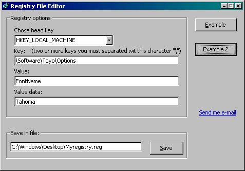



## Registry File Editor

### Description

This code show you how writing Registyr File (*.reg).

It's easy and example.
 
### More Info
 

             |
---                |---
**Submitted On**   |2002-02-20 01:27:42
**By**             |[Franjo Boras](https://github.com/Planet-Source-Code/PSCIndex/blob/master/ByAuthor/franjo-boras.md)
**Level**          |Advanced
**User Rating**    |4.0 (12 globes from 3 users)
**Compatibility**  |VB 4\.0 \(32\-bit\), VB 5\.0, VB 6\.0, VB Script, ASP \(Active Server Pages\) , VBA MS Access, VBA MS Excel
**Category**       |[Registry](https://github.com/Planet-Source-Code/PSCIndex/blob/master/ByCategory/registry__1-36.md)
**World**          |[Visual Basic](https://github.com/Planet-Source-Code/PSCIndex/blob/master/ByWorld/visual-basic.md)
**Archive File**   |[Registry\_F565132202002\.zip](https://github.com/Planet-Source-Code/franjo-boras-registry-file-editor__1-31987/archive/master.zip)

